# Model Metrics Plot for LM task

## I - RATIO

> lm_test_flops_ratio_2_gfish

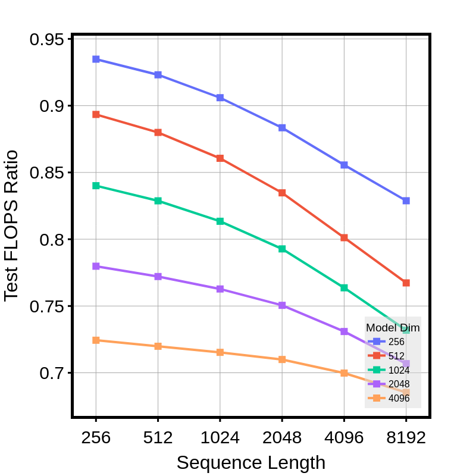

> lm_train_flops_ratio_2_gfish

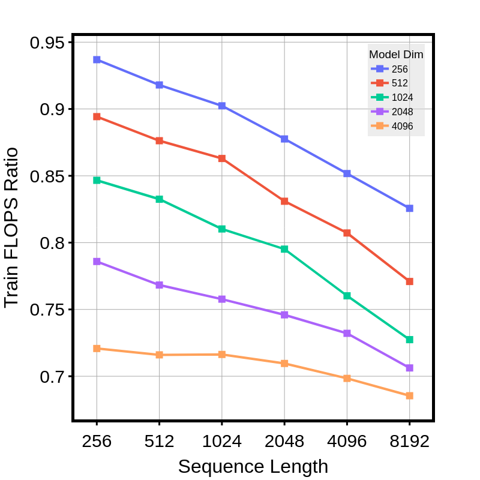

> lm_test_time_ratio_2_gfish

> lm_train_time_ratio_2_gfish

> lm_params_ratio_2_gfish

> lm_memory_ratio_2_gfish_test_only

> lm_memory_ratio_2_gfish

## II - ABSOLUTE

> lm_test_flops_abs_2_gfish_d1024

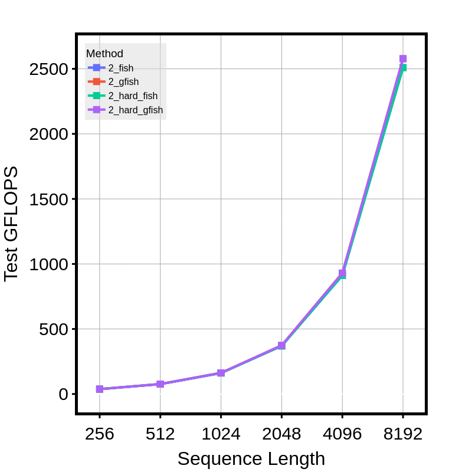

> lm_train_flops_abs_2_gfish_d1024

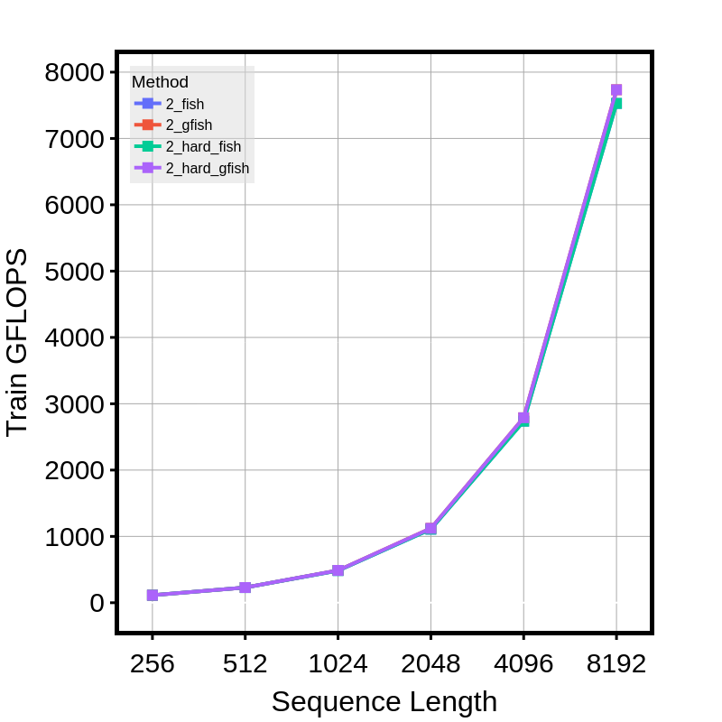

> lm_test_time_abs_2_gfish_d1024

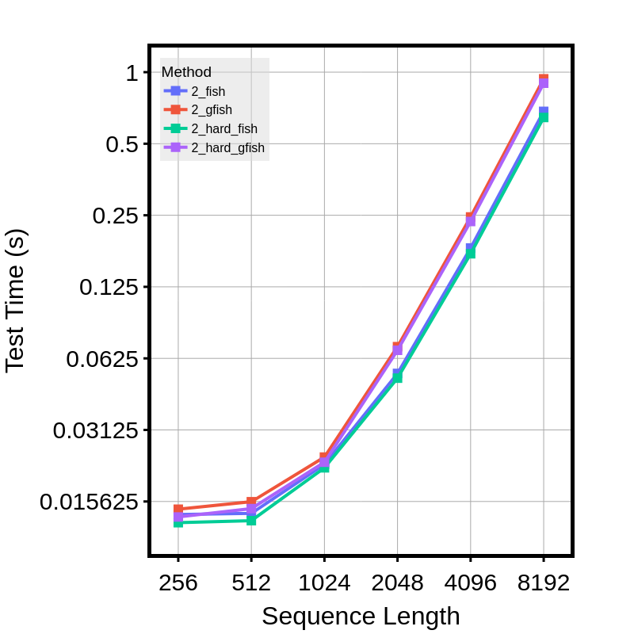

> lm_train_time_abs_2_gfish_d1024

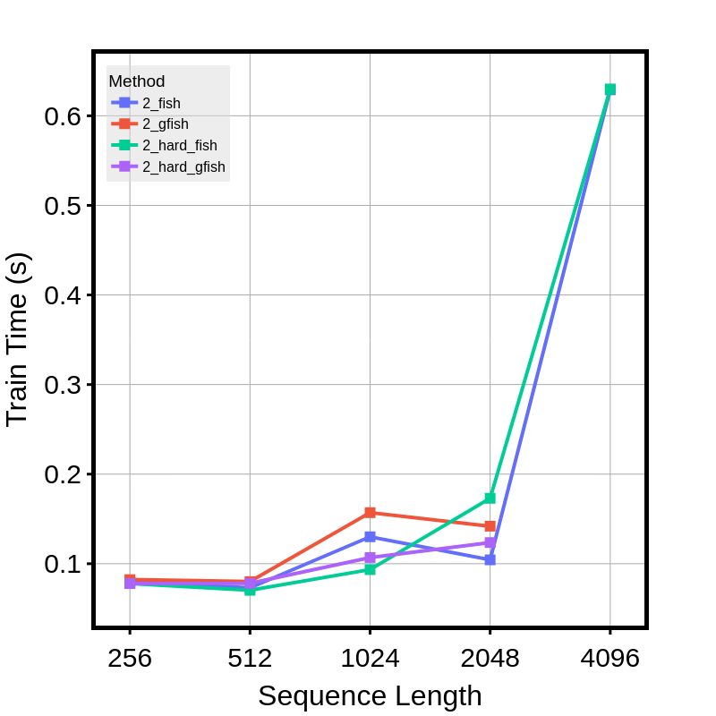

> lm_params_abs

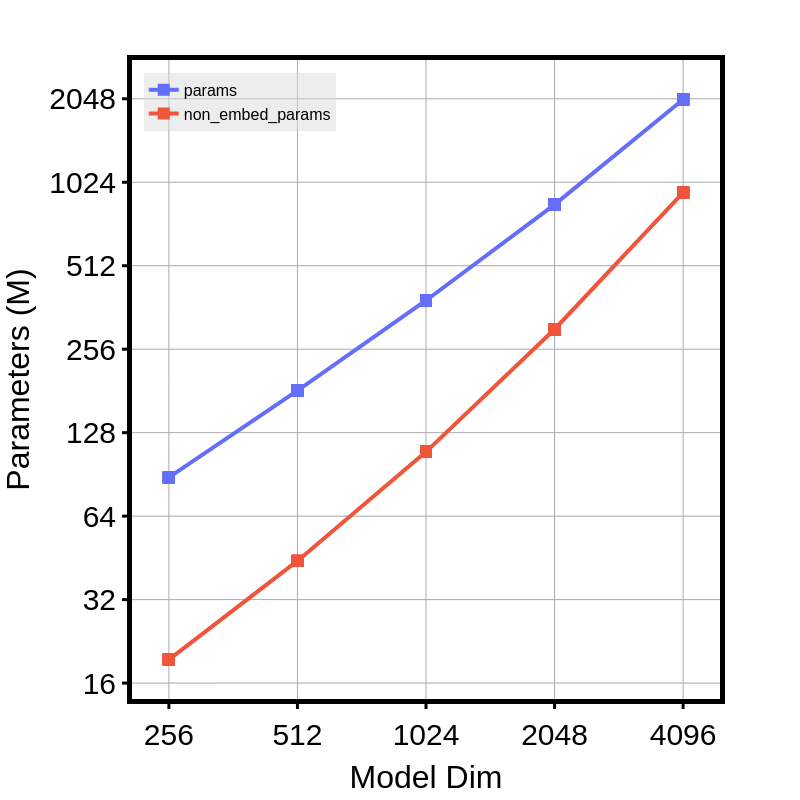

> lm_test_memory_abs

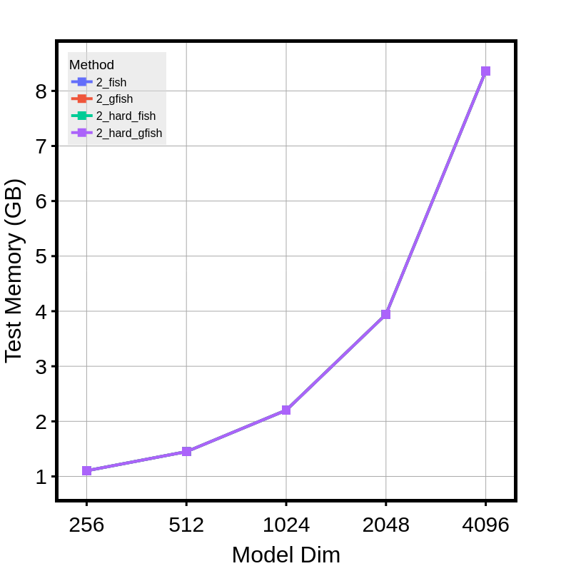

> lm_train_memory_abs

## III - RATIO PER HEAD

> lm_test_flops_head_ratio_gfish

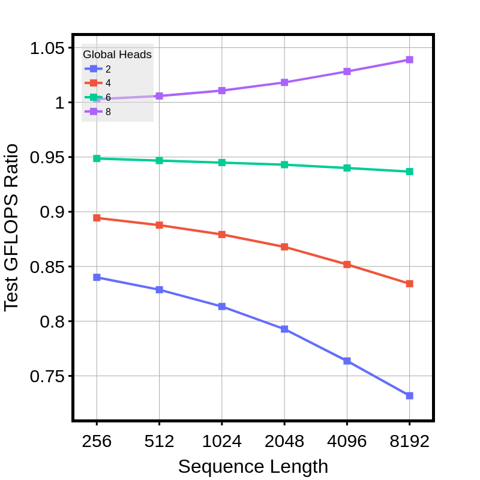

> lm_train_flops_head_ratio_gfish

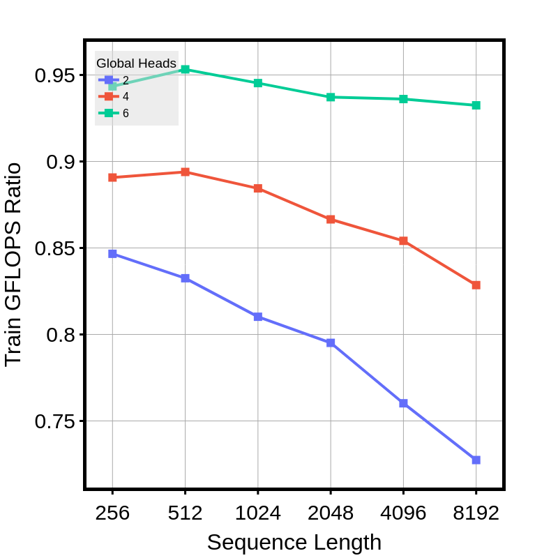

> lm_test_time_head_ratio_gfish

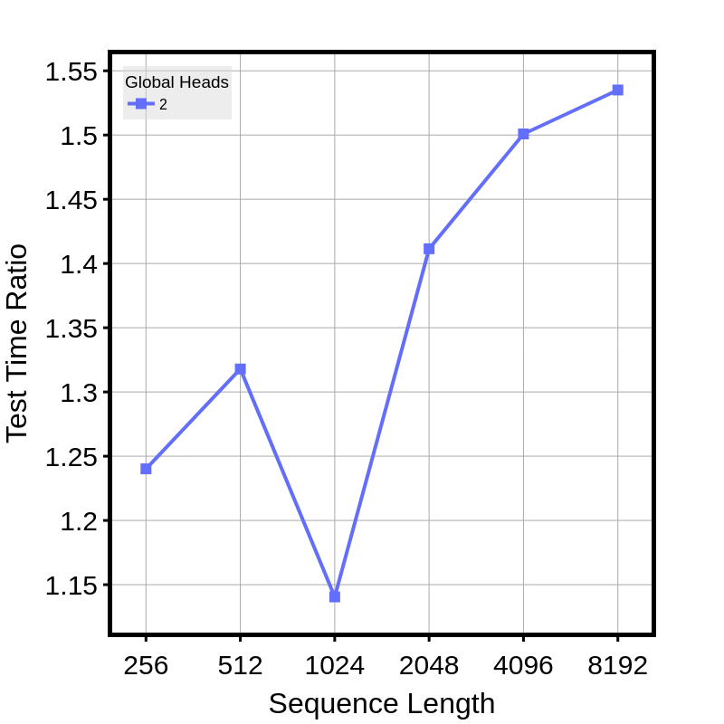

> lm_train_time_head_ratio_gfish

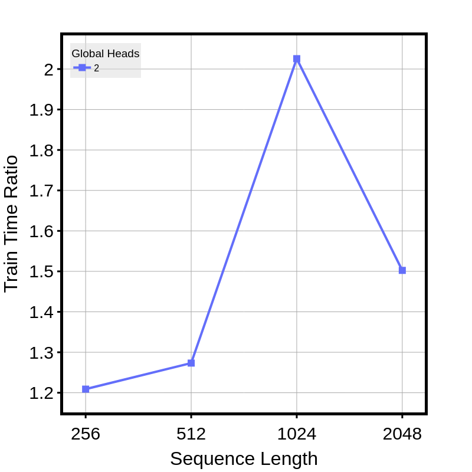

> lm_params_head_ratio_gfish

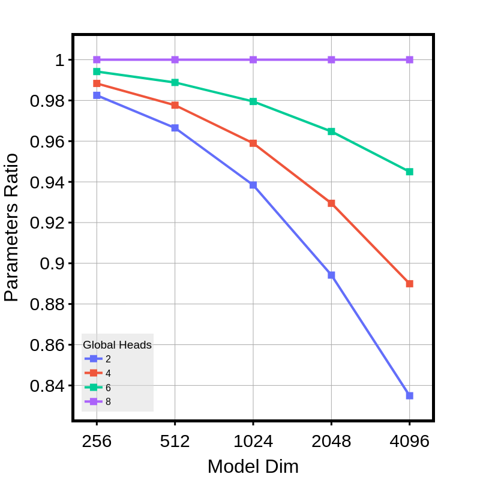

> lm_non_embed_params_head_ratio_gfish

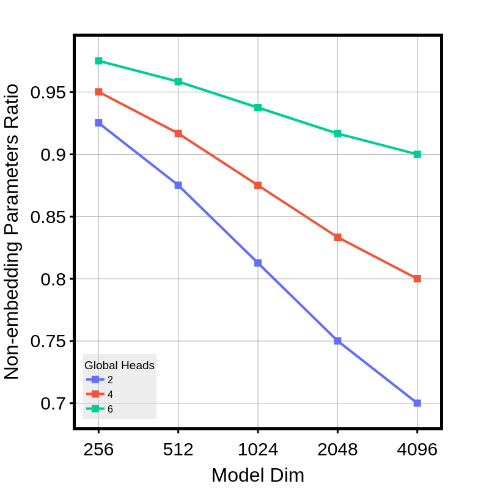

> lm_test_memory_head_ratio_l1024_gfish

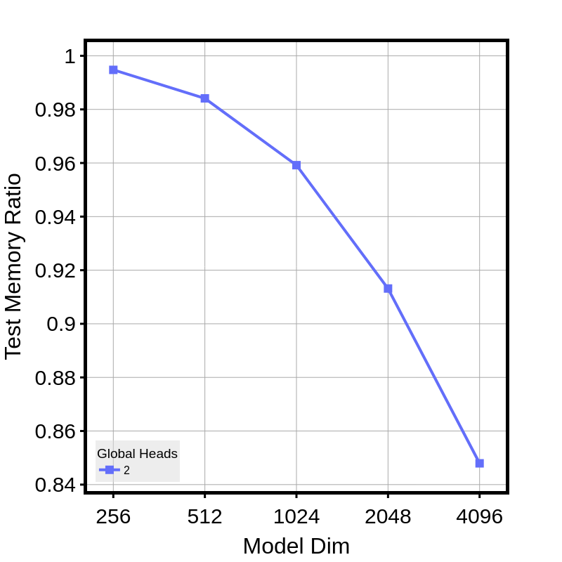

> lm_train_memory_head_ratio_l1024_gfish

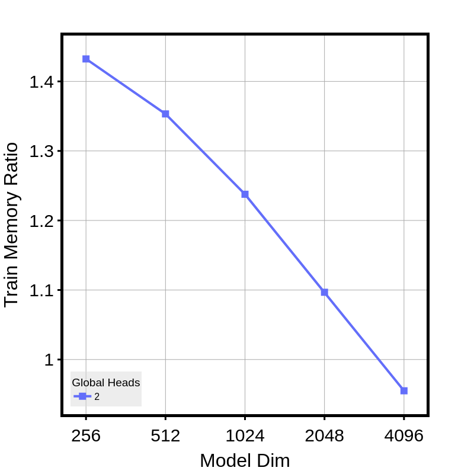