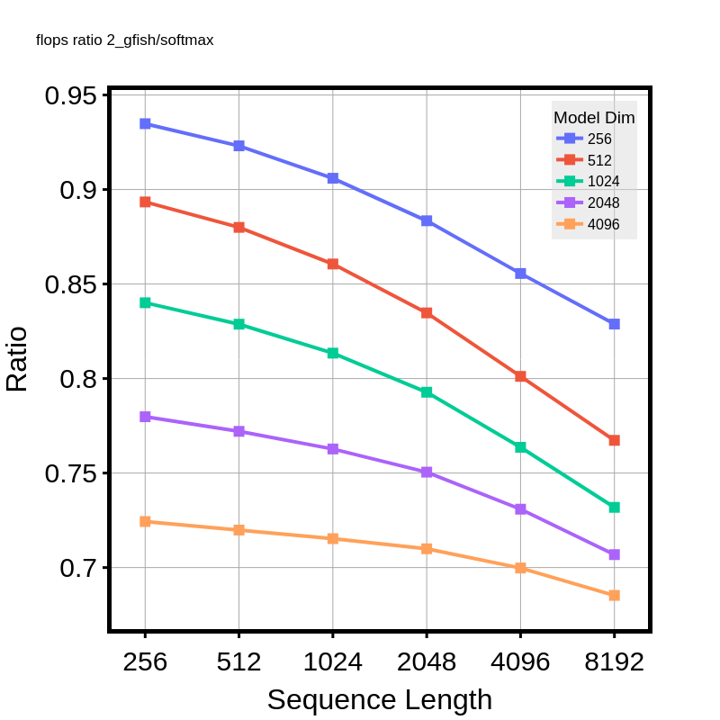
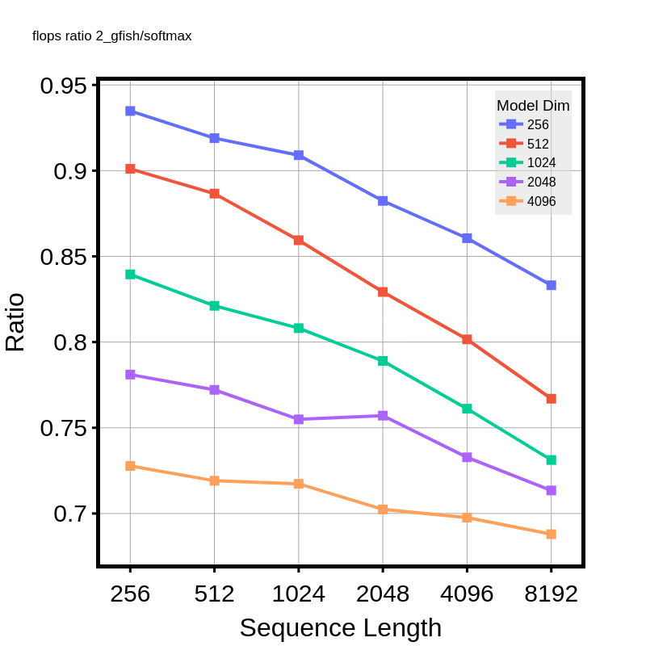
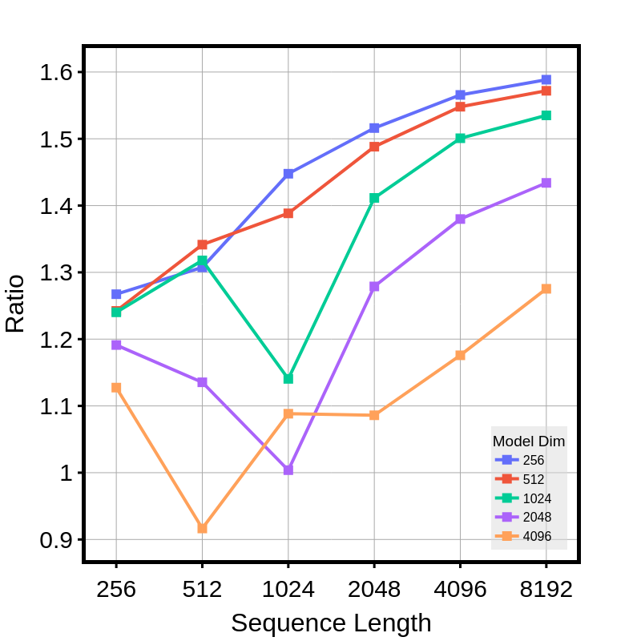
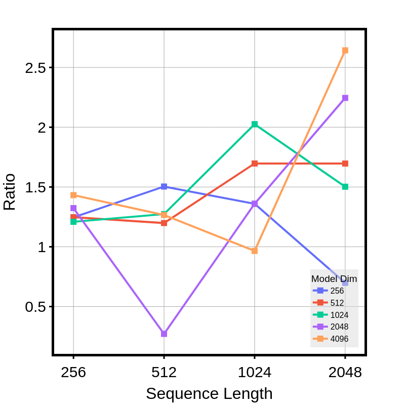
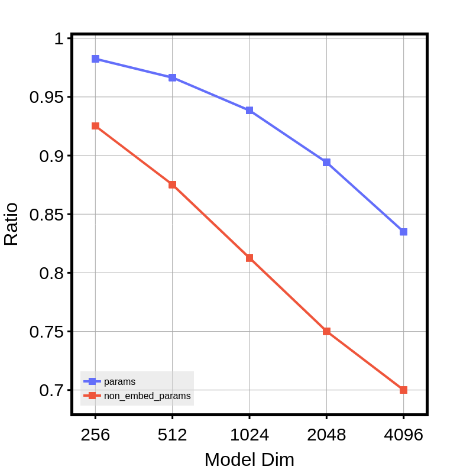
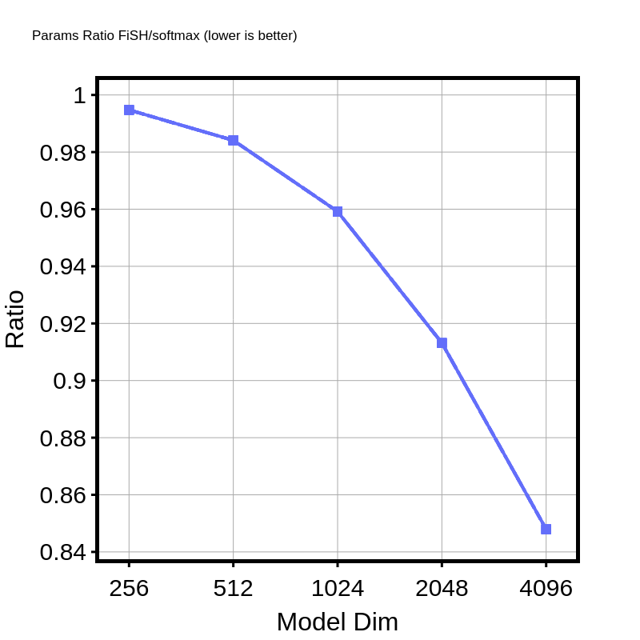
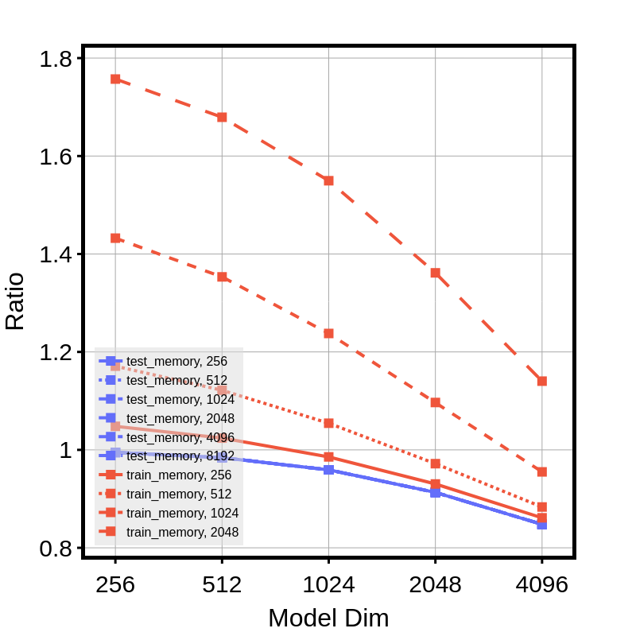

## Model Metrics Plot for LM task

> lm_flops_test_ratio_2_gfish

> lm_flops_train_ratio_2_gfish

> lm_test_time_ratio_2_gfish

> lm_train_time_ratio_2_gfish

> lm_params_ratio_2_gfish

> lm_memory_ratio_2_gfish_test_only

> lm_memory_ratio_2_gfish

