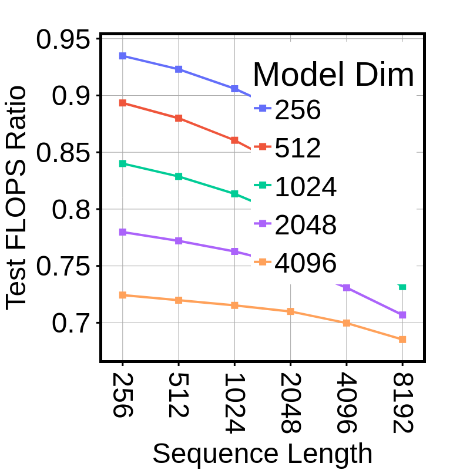
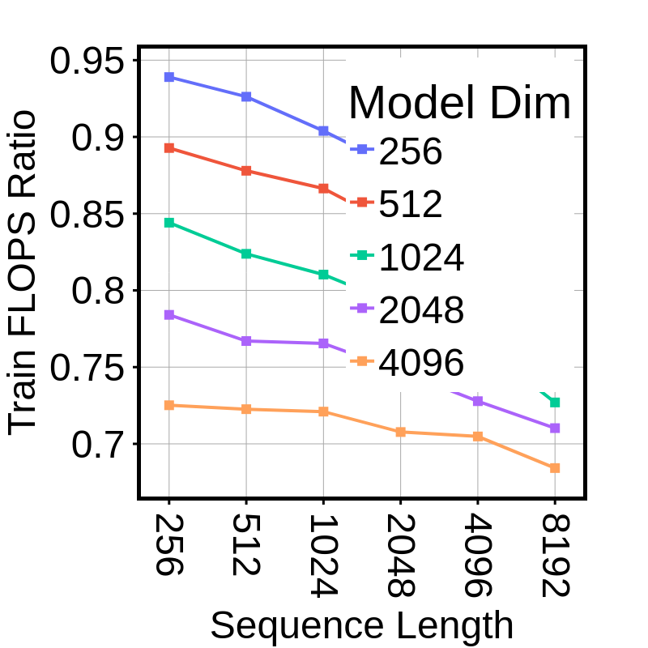
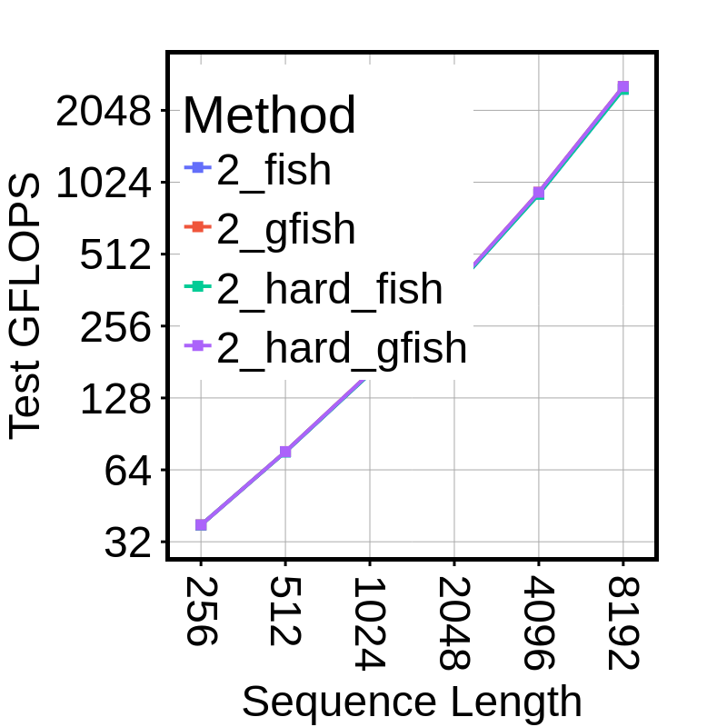
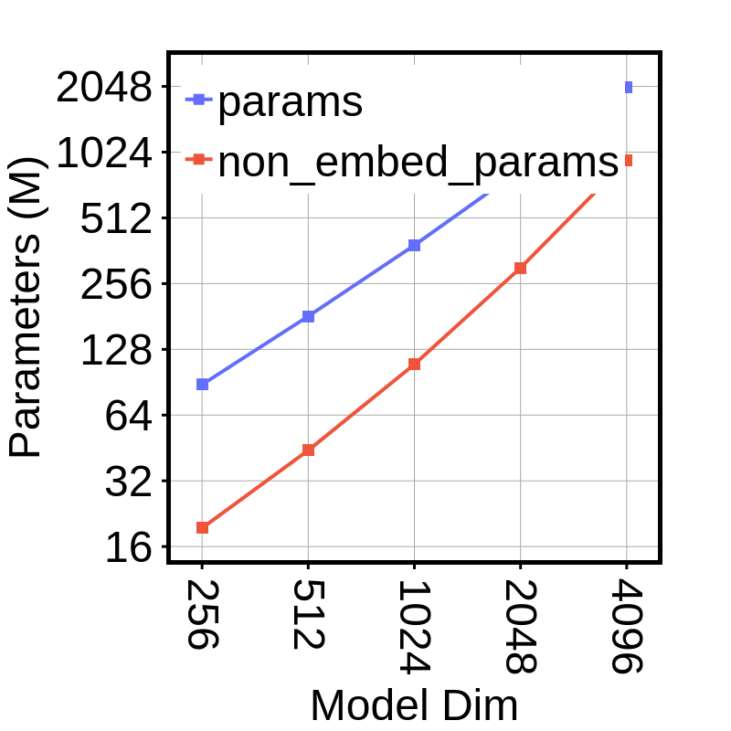
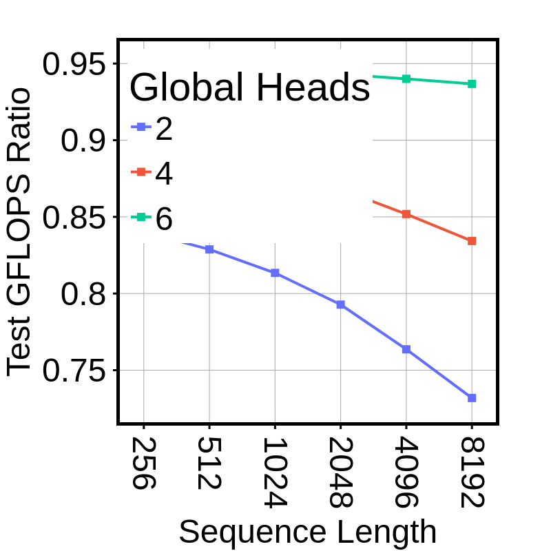
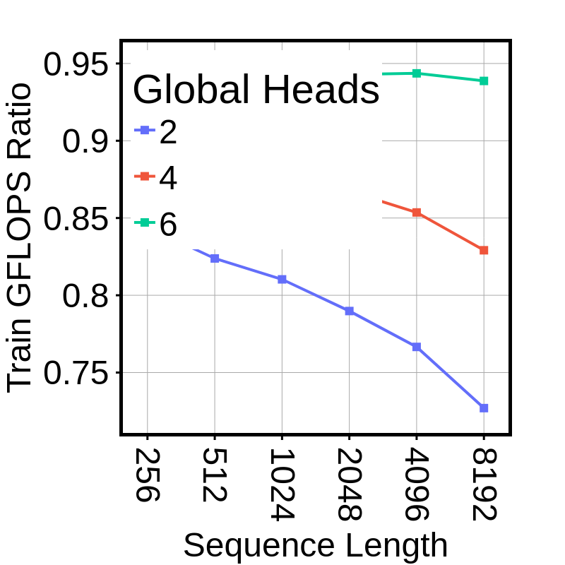
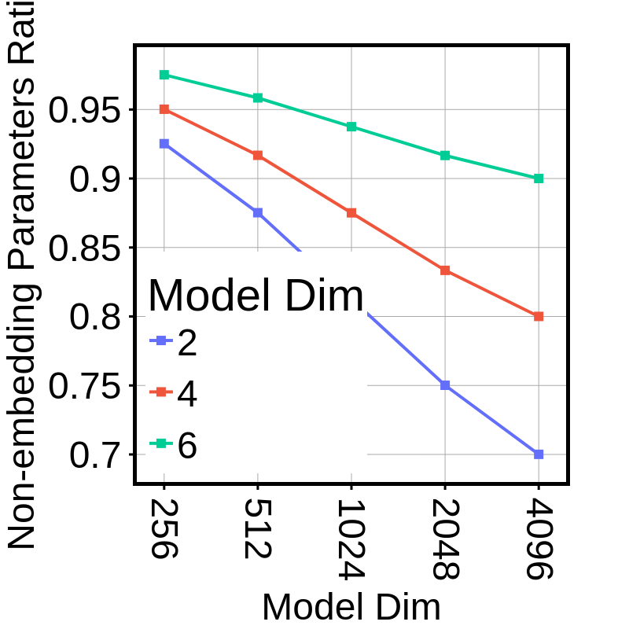
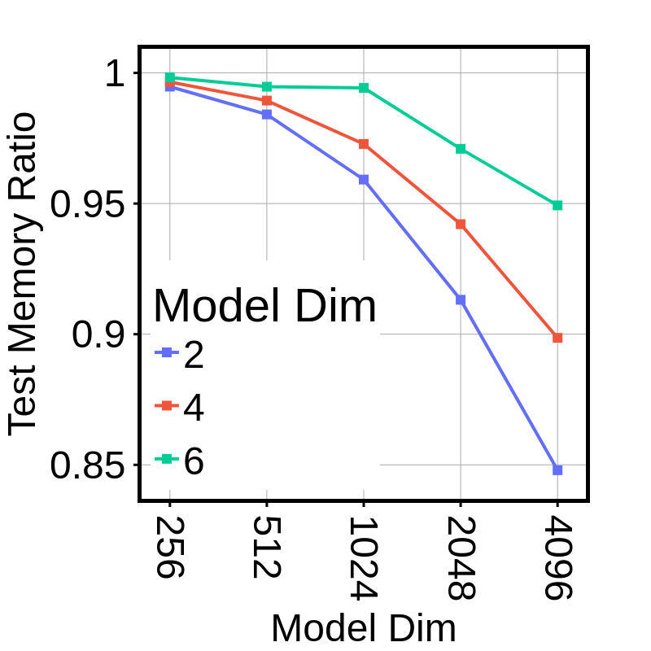

# Model Metrics Plot for LM task

## I - RATIO

> lm_ratio_test_flops_2_gfish

> lm_ratio_train_flops_2_gfish

> lm_ratio_test_time_2_gfish

> lm_ratio_train_time_2_gfish

> lm_ratio_params_2_gfish

> lm_memory_ratio_2_gfish_test_only

> lm_ratio_memory_2_gfish

## II - ABSOLUTE

> lm_abs_test_flops_2_gfish_d1024

> lm_abs_train_flops_2_gfish_d1024

> lm_abs_test_time_2_gfish_d1024

> lm_abs_train_time_2_gfish_d1024

> lm_abs_params

> lm_abs_test_memory

> lm_abs_train_memory

## III - RATIO PER HEAD

> lm_head_ratio_test_flops_gfish

> lm_head_ratio_train_flops_gfish

> lm_head_ratio_test_time_gfish

> lm_head_ratio_train_time_gfish

> lm_head_ratio_params_gfish

> lm_head_ratio_non_embed_params_gfish

> lm_head_ratio_test_memory_l1024_gfish

> lm_head_ratio_train_memory_l1024_gfish

